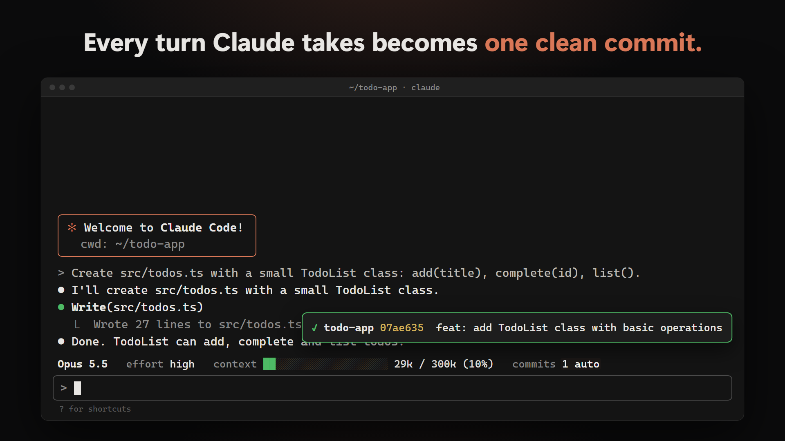
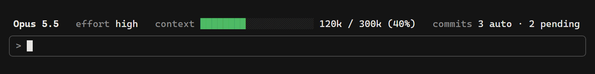
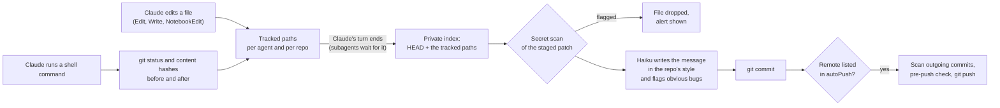

<p align="center">
  
</p>

# claude-autocommit

### Claude Code commits its own work. One clean commit per turn, a real message, and nothing that was not Claude's.

[](https://github.com/Iliesseu28/claude-autocommit/actions/workflows/ci.yml)


[](LICENSE)

Let Claude work for an hour and you usually end up with one of two things: a giant uncommitted blob mixing
Claude's work with yours, or a string of `wip` commits. Asking Claude to commit costs a turn, and it tends to
`git add -A` whatever is lying around.

**autocommit** is a Claude Code mod that watches which files Claude itself changes. When the turn ends, it makes
one commit per repo with a message written from the actual diff in the style of your recent commits, scans it for secrets first,
and leaves everything else in your working tree exactly as it was.

https://github.com/user-attachments/assets/188f606e-935e-4aaa-b0c4-e5736469e642

## Install

In Claude Code:

```text
/plugin marketplace add Iliesseu28/claude-autocommit
/plugin install autocommit@claude-autocommit
```

That's it: the defaults work. Change a setting any time with `/plugin configure autocommit@claude-autocommit`.

Needs [git](https://git-scm.com) and a Claude Code build with mods (function hooks); tested on Claude Code 2.1.288,
on Windows 11 and in headless `claude -p` runs.

## What you get

| | |
|---|---|
| **One commit per turn, per repo** | Claude's changes land as soon as its answer is done, about two seconds later. |
| **Only Claude's files** | An edit is tracked by its path. A shell command is judged by comparing `git status` and file contents before and after it. Your own edits in the same repo stay out. |
| **A message from the diff** | Haiku writes the subject in the style of the repo's last hand-written subjects (type words, scope, capitalization; Conventional Commits when there are none) and one to three lines on *why*, in the language you pick. |
| **A second pair of eyes** | The same call flags obvious slips in the diff (debug leftover, broken reference, half-finished code) as an alert. |
| **A secret guard** | Every commit and every push is scanned: over 20 key formats, `.env`, `.pem`, `.p8`, `.p12`, SSH keys, service accounts. A flagged file is never committed. |
| **Your index untouched** | Commits are built in a private git index. Whatever you had staged stays staged. |
| **Subagents handled** | A subagent that finishes while Claude is still working waits for the end of Claude's turn, then gets a commit of its own. Files Claude already committed by hand are left alone. |
| **A stale index warning** | When git's own index holds 10 or more staged entries that differ from the disk (often an old index a folder sync copied back), one alert per repo says how to see and clear them. Your index is never changed. |
| **Undo, squash, push** | `/commits undo`, `/commits squash`, `/commits push`. |
| **A status bar** | Model, effort, context gauge, Remote Control, and the commit counters, above the prompt. |

<p align="center"></p>

## How it works



Each commit ends with two trailers: `Auto-commit: claude-autocommit` (so `git log --grep "Auto-commit:"` finds them
all) and the commit attribution of your Claude Code settings (by default
`Co-Authored-By: Claude <model> <noreply@anthropic.com>`; set it empty in your settings to drop it).

## Commands

| Command | What it does |
|---|---|
| `/commits` | Report: latest commits, alerts, files still pending. Clears the alert count. |
| `/commits pause` / `resume` | Holds commits (files are still tracked), then sends them. |
| `/commits now` | Commits every pending file now, subagents included, without waiting for a turn to end. |
| `/commits undo` | Drops the session's last auto-commit if it is still `HEAD` and unpushed. Its files stay changed, uncommitted. |
| `/commits squash` | Folds the session's unpushed auto-commits sitting in a row at `HEAD` into one, with a new message. No file is touched. |
| `/commits push` | Pushes the session's repos now: secret scan of the outgoing commits, your pre-push check, then `git push`. |

French words work too: `reprendre`, `tout`, `annuler`, `fusionner`, `pousser`.

To keep a repo out entirely, create an empty `.no-auto-commit` file at its root (and list it in `.git/info/exclude`).

## Settings

| Setting | Default | What it does |
|---|---|---|
| `language` | `en` | Language of the bar, alerts and report: `en` or `fr`. |
| `commitModel` | `haiku` | Model that writes the messages: `haiku`, `sonnet` or `opus`. |
| `commitLanguage` | `English` | Language of the commit messages: any language name. |
| `bugCheck` | `true` | Ask the model to flag obvious bugs in the diff. |
| `autoPush` | empty | Remotes to push to after each commit, comma separated: `me/notes`, `github.com/me`, or `*` for all. Empty: never pushes unless you ask. A push sends the whole branch, so your own unpushed commits on it go too (scanned like the others). |
| `prePushCommand` | empty | A command that must succeed before any push. `{root}` is the repo root, `{files}` a file listing the paths the push changes. |
| `bar` | `full` | `full`, `compact` (context and commits only) or `off`. |
| `maxFilesPerCommand` | `40` | A shell command that changes more files than this at once (an install into a tracked folder, a code generator) is reported instead of committed. |

## What it never does

- **Commit a file Claude did not change.** Your other dirty files stay out. (A file Claude does edit is committed whole, so
  any uncommitted change you had already made to that same file goes with it.)
- **Touch what you staged.** The commit is built in an index file of its own in `.git` (one per session); afterwards only
  the committed paths are refreshed in your index.
- **Run beside a git command of Claude's.** If Claude commits by hand, the command waits for an auto-commit under way, and
  no auto-commit starts while it runs. No `index.lock` fights, no commit built on a stale `HEAD`.
- **Undo someone else's commit.** If `HEAD` moves while the auto-commit is being made (a commit from your terminal,
  another session, a pull), the auto-commit is rolled back and retried next turn; your commit stays on top.
- **Commit mid-merge, mid-rebase, mid-cherry-pick or on a detached `HEAD`.** The files wait.
- **Commit a likely secret** or a new file over 5 MB.
- **Push unless you asked** or the remote is in `autoPush`. Never a force push.
- **Rewrite pushed history.** `undo` and `squash` only touch unpushed commits made in this session.
- **Lose your index on a crash.** A small journal in `.git/AUTOCOMMIT_RESET` lets the next run finish the index refresh.
- **Leave files behind in `.git`.** The message goes to git on stdin; the private index, the push list and the journal are
  deleted as soon as they have served.

## Honest limits

- During a shell command, the mod compares the repo before and after. A file **you** save in your editor while that
  command runs looks like the command's work and will be committed with it.
- Two sessions editing the same file: the commit takes the file as it is on disk.
- A subagent's files are committed when Claude's turn ends (at once if Claude is already idle), one commit per agent.
  In headless `claude -p` runs they are committed when the subagent finishes, as the process may exit before another
  answer. If a commit is refused, the files are retried each time a turn ends.
- The stale index warning reads the `git status` an auto-commit already runs, so it only shows in a repo where Claude
  changed something.
- Files still pending when you quit stay uncommitted (they show in `git status`); a new session does not pick them up.
- Your git hooks do not run on auto-commits: Claude Code starts a mod's git commands with the repo's hooks turned off,
  a safety default. Checks that must pass belong in `prePushCommand` (run before every push) or in CI.
- Alerts are notifications and the `/commits` report. In headless `claude -p` runs nobody sees them: read `git log`.
- The secret scan is pattern based. It catches the common key formats, not every secret; keep a real scanner such as
  [gitleaks](https://github.com/gitleaks/gitleaks) in your `prePushCommand` or CI if a leak would hurt.

## FAQ

**Does it slow Claude down?**
An edit costs one cached lookup. A shell command that may write costs `git status` plus a content hash before and
after it; read-only commands (`ls`, `cat`, `grep`, `git status`, `git log`, `git diff`...) skip it. The commit itself
runs after the answer, outside the turn.

**What does it cost?**
One small model call per commit (a trimmed diff in, about a hundred tokens out), on your own Claude Code plan.
With `haiku`, a fraction of a cent at API prices.

**Can I still write my own commits?**
Yes. Commit whenever you like: autocommit only commits what is still pending at the end of a turn. Or `/commits pause`.

**Will it commit my `.env`?**
No. `.env*` (except `.env.example`), key files, keystores and service accounts are held back by name, before any scan.

**My repos live in a synced folder (Syncthing, Dropbox, iCloud). Anything to know?**
A sync that copies `.git` between machines can bring an old index back: `git status` then lists staged changes nobody
made, and a plain `git commit` would commit them all. The mod warns once per repo when it sees 10 or more. See them
with `git diff --cached --stat`; if they are not wanted, `git reset -q` clears them without touching the files on disk;
or commit by naming files, `git commit -- <files>`. Auto-commits are built in an index of their own and leave nothing
in `.git` for the sync to copy.

**Does it work in a monorepo, a worktree, or several repos at once?**
Yes. Each file is mapped to its own repo root by git; one turn that touches three repos makes three commits.

## Uninstall

```text
/plugin uninstall autocommit@claude-autocommit
```

## Development

```bash
claude plugin validate . --strict      # marketplace manifest
claude plugin validate .claude-plugin/plugin.json --strict
claude plugin test .                   # 48 tests: pure helpers, then whole sessions against a fake git
python3 scripts/check.py               # JSON, manifests, no long dash, no machine path
```

| File | Role |
|---|---|
| `hooks/register.tsx` | The hooks: tracking, commit, push, undo, squash, the bar. |
| `hooks/git.ts` | Pure helpers: porcelain parsing, read-only command detection, prompts, message layout. |
| `hooks/secrets.ts` | Key patterns and forbidden file names. |
| `hooks/config.ts`, `hooks/i18n.ts` | Settings and the English and French strings. |
| `types/index.d.ts` | The state contract checked by `claude plugin validate`. |

## License

[MIT](LICENSE)
